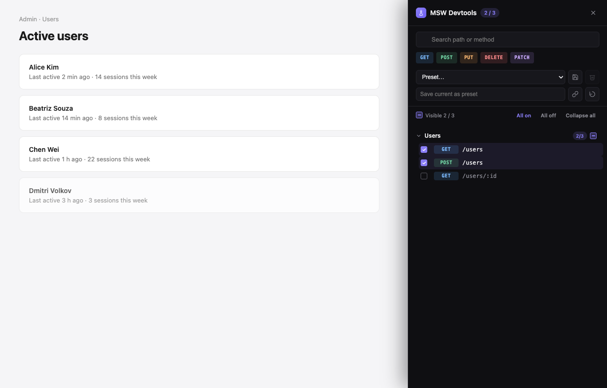

# msw-devtools

Visual devtools for toggling [MSW](https://mswjs.io) handlers at runtime.

- **Framework-agnostic core** + thin React adapter
- **Modern dark-first UI** — no MUI/styled-components/zustand in your bundle
- **Persistent state** + URL-share-able mock sets
- **SSR-safe** — works in Next.js App Router & Pages Router
- **Zero impact on your styles** — scoped CSS, no globals



## Install

```bash
# React
pnpm add -D @juddroid_raccoon/msw-devtools-react msw

# Vanilla / any framework
pnpm add -D @juddroid_raccoon/msw-devtools-core msw
```

## Quick start (React)

```tsx
'use client';
import { MswDevtools } from '@juddroid_raccoon/msw-devtools-react';
import { handlers } from './mocks/handlers';

export function Providers({ children }) {
  return (
    <MswDevtools
      handlers={handlers}
      enabled={process.env.NODE_ENV !== 'production'}
    >
      {children}
    </MswDevtools>
  );
}
```

You also need MSW's service worker file in `public/`:

```bash
pnpm dlx msw init public/ --save
```

## Quick start (vanilla)

```ts
import { createMswDevtools } from '@juddroid_raccoon/msw-devtools-core';
import { handlers } from './handlers';

const devtools = createMswDevtools({ handlers });
devtools.mount();
```

## Recipes

### axios — show "enable mock" toast on a failed request

```tsx
import { useEffect } from 'react';
import { useMswDevtools } from '@juddroid_raccoon/msw-devtools-react';
import axios from 'axios';

export function AxiosBridge() {
  const { notifyUnhandledRequest } = useMswDevtools();
  useEffect(() => {
    const id = axios.interceptors.response.use(undefined, (err) => {
      notifyUnhandledRequest({
        method: err.config?.method ?? '',
        url: (err.config?.baseURL ?? '') + (err.config?.url ?? ''),
      });
      throw err;
    });
    return () => axios.interceptors.response.eject(id);
  }, [notifyUnhandledRequest]);
  return null;
}
```

### react-query — refetch on mock change

```tsx
const queryClient = useQueryClient();
<MswDevtools
  handlers={handlers}
  onMockChange={() => queryClient.refetchQueries({ type: 'all' })}
>
  {/* … */}
</MswDevtools>
```

### Group handlers by path prefix

```tsx
<MswDevtools
  handlers={handlers}
  groupBy={(path) => {
    if (path.startsWith('/admin')) return 'Admin';
    if (path.startsWith('/users')) return 'Users';
    return 'Other';
  }}
/>
```

## API

See [the design spec](./docs/superpowers/specs/2026-05-28-msw-devtools-design.md) for the full reference. The most important option set:

| Option | Default | Purpose |
|---|---|---|
| `handlers` | (required) | MSW request handlers |
| `baseUrl` | `undefined` | API prefix stripped from displayed paths |
| `groupBy` | `() => 'Other'` | Group inference |
| `defaultEnabled` | `[]` | First-run enabled keys |
| `storageKey` | `'msw-devtools'` | localStorage namespace |
| `position` | `'bottom-right'` | FAB anchor |
| `theme` | `'auto'` | `'light' \| 'dark' \| 'auto'` |
| `enabled` (React only) | `true` | Production gate |
| `onMockChange` | — | Called after toggles, debounced |

## Compatibility

- React 18 and 19
- Node 18+
- MSW v2
- Vite, Webpack 4/5, Rollup, esbuild, Turbopack, Parcel
- Next.js (App Router + Pages Router) with `'use client'` preserved

## License

MIT © 2026 Dongcheol Jeong

---

### 한국어

MSW handler를 런타임에 시각적으로 켜고 끄는 devtools. React + vanilla.

자세한 설계는 [디자인 스펙](./docs/superpowers/specs/2026-05-28-msw-devtools-design.md) 참고.
